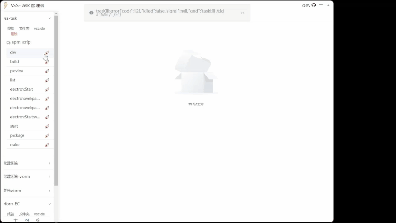

<h1 align="center" style="display: flex; justify-content: center; align-items: center;">

Vss-Task
</h1>

<h6 align="center">
更方便的启动和管理项目中的任务(vscode-task,npm...)
</h6>

#### 酷炫的启动动画

#### 系统设置
##### 可以配置自己的启动任务gif库

#### 多图预览

